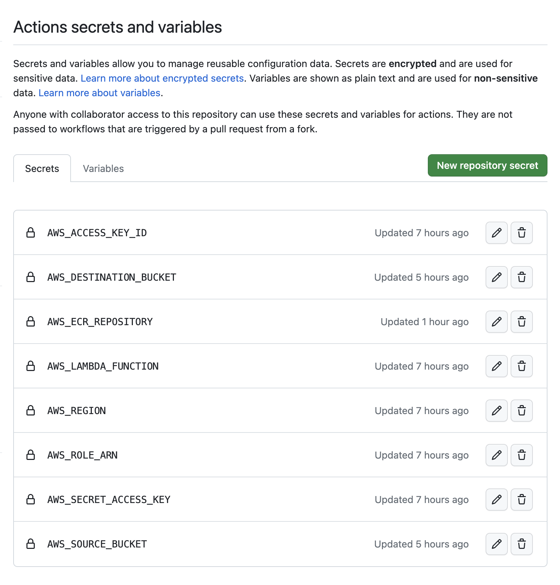

# postag

Satellite AIS message position tagging.

Provides a deployable Python AWS lambda function that parses NMEA sentences from a source bucket and updates a destination bucket with location metadata.

Task description, for reference available [here](assets/task.pdf).

## Nomenclature

Spire's AIS message stream format comprises of a group(`\g`), source(`\s`) and timestamp checksum(`\c`) tags, prepended to an AIVDM payload.
For more, refer to ["Understanding the AIS message stream format"](https://documentation.spire.com/tcp-stream-v2/using-the-tcp-stream/multipart-messages).

The postag service adds location metadata tags to the AIS message stream sentences in the following format.

- `\p`: Longitude of the sub satellite point at the time of the message.
- `\q`: Latitude of the sub satellite point at the time of the message.
- `\r`: Red flag, denoting that vessel's position in the message is outside of the satellite’s footprint.

<b>TODO: </b>A spoofed message will contain the red flag tag, `\r SPOOF` while a valid message would look like `\r OK`.

## Challenges

The lambda function implementation in itself is fairly trivial. Designing an end-to-end robust solution was a bit involved due to the following factors.

1. Patching [simpleais](https://github.com/wpietri/simpleais/pull/3)

    Instead of downloading S3 objects from the source bucket and passing each of them as inputs to [simpleais](https://github.com/wpietri/simpleais), a cleaner approach was to directly pass the S3 bucket URI to [simpleais](https://github.com/wpietri/simpleais).

    This required patching [simpleais](https://github.com/wpietri/simpleais) to handle blob source inputs.

    I've raised a PR with this change to the upstream repository: https://github.com/wpietri/simpleais and have included the patched source inside the [`postag/libs`](./postag/libs/) directory.

2. Repeatable builds

    One of the major take aways from my onsite interview disussions was the challenge of repeatable builds for Spire's legacy monoliths. I discussed a few generic approaches to circumvent this during my chat with @yuasatakayuki-spire, but they were more around sound engienering best practices.

    In hindsight, the usage of a dependency manager like [poetry](https://python-poetry.org) might be just the tool to tackle this pain.

    [poetry](https://python-poetry.org) preserves all dependencies in a lock file and always installs from it. This ensures any changes to sub-dependencies caused by a top-level dependency is caught pre-emptively by a conflict in the lock file.

    This gives the developers ample time to perform remedial actions and ensures repeatable builds across all environments.

3. Containerised runtime environments

    While [poetry](https://python-poetry.org) is a powerful tool to ensure repeatable builds, setting up a container with [poetry](https://python-poetry.org/) and it's enforced dependencies is somewhat tricky.

    Further to this, there were two unique challenges with deploying to AWS lambda's runtime environments.

    1. Loading shared object files in lambda runtime environment

        The [pypredict](https://pypi.org/project/pypredict) library depends on the `cpredict` shared object, which when compiled on an `osx-darwin` M1 architecture, fails to load in an AMD64 linux runtime. This rendered zip archive lambda packages unusable.

    2. Custom container images for lambda deployments

        Amazon provides a set of Amazon Machine Images(AMI) with Python runtimes. However, the `cpredict` shared object was still not loadable in containers with these base images, possibly due to `gcc`/`libc ` version differences.

    Finally, in the interest of reproducability, I authored a multi-stage build [`Dockerfile`](./Dockerfile) with an `ubuntu` base image which did the trick.

4. Automated CI workflows and deployments

    1. `tox` virtual environments and [poetry](https://python-poetry.org) installations can override one another in CI workflows. It was hence necessary to use a [tox plugin for poetry](https://github.com/enpaul/tox-poetry-installer) in the `tox` script.

    2. Part of the problem statement is to invoke the uploaded lambda function periodically. This can be setup via an [AWS CloudWatch rule](https://docs.aws.amazon.com/AmazonCloudWatch/latest/events/Create-CloudWatch-Events-Scheduled-Rule.html) or even a simple [scheduled Github Actions workflow](https://docs.github.com/en/actions/using-workflows/events-that-trigger-workflows#schedule).

## Usage

Fork the repository or contact the repository administrator and setup the necessary Github Actions secrets for your AWS instances.



Once setup, simply initiate a deployment by pushing to the `deploy` branch of the repository.
```bash
$ git clone git@github.com:tinvaan/postag.git
$ cd postag
$ git checkout -b deploy
$ git push origin deploy
```

This will trigger the Github Actions deployment workflow. Once complete, you can invoke the lambda function via the AWS CLI or wait for the periodic triggers via AWS CloudWatch rules.

```bash
$ aws lambda invoke --function-name $AWS_LAMBDA_FUNCTION /tmp/response.json
```

## Development

The project officially supports Python `3.9` and `3.10` environments and while it may be possible to run the project with `3.7` and `3.8`, it is not recommended.

### Requirements

The required dependences along with their versions are listed in the [`poetry.lock`](./poetry.lock) file. Follow instructions to install [poetry](https://python-poetry.org/docs/#installation) and then install the project dependencies using the same.

```bash
$ poetry install --no-root
```

### Tests
Unit tests can be run by invoking the `tox` command for the approrpriate environment. For eg
```bash
$ tox -e py3.9

.package recreate: /Users/harish/Workspaces/interviews/spire/postag/.tox/.package
.package installdeps: poetry-core
py39 recreate: /Users/harish/Workspaces/interviews/spire/postag/.tox/py39
py39 tox-poetry-installer: Installing 40 dependencies from Poetry lock file (using 10 threads)
py39 inst: /Users/harish/Workspaces/interviews/spire/postag/.tox/.tmp/package/1/postag-0.1.0.tar.gz
py39 installed: boto3==1.26.115,botocore==1.29.115,certifi==2022.12.7,cffi==1.15.1,charset-normalizer==3.1.0,colorama==0.4.6,coverage==7.2.3,cryptography==40.0.2,exceptiongroup==1.1.1,idna==3.4,iniconfig==2.0.0,Jinja2==3.1.2,jmespath==1.0.1,MarkupSafe==2.1.2,moto==4.1.7,multidict==6.0.4,packaging==23.1,pluggy==1.0.0,postag @ file:///Users/harish/Workspaces/interviews/spire/postag/.tox/.tmp/package/1/postag-0.1.0.tar.gz,pycparser==2.21,pypredict==1.7.0,pytest==7.3.1,pytest-cov==4.0.0,pytest-sugar==0.9.7,pytest-vcr==1.0.2,python-dateutil==2.8.2,PyYAML==6.0,requests==2.28.2,responses==0.23.1,s3transfer==0.6.0,six==1.16.0,smart-open==6.3.0,termcolor==2.2.0,tomli==2.0.1,types-PyYAML==6.0.12.9,urllib3==1.26.15,vcrpy==4.2.1,Werkzeug==2.2.3,wrapt==1.15.0,xmltodict==0.13.0,yarl==1.8.2
py39 run-test-pre: PYTHONHASHSEED='527711426'
py39 run-test: commands[0] | poetry install --no-root -v
Using virtualenv: /Users/harish/Workspaces/interviews/spire/postag/.tox/py39
Installing dependencies from lock file

Finding the necessary packages for the current system

Package operations: 42 installs, 0 updates, 0 removals, 39 skipped

  • Installing more-itertools (9.1.0)
  • Installing zipp (3.15.0)
  • Installing attrs (23.1.0)
  • Installing crashtest (0.4.1)
  • Installing distlib (0.3.6)
  • Installing filelock (3.12.0)
  • Installing importlib-metadata (6.5.0)
  • Installing jaraco-classes (3.2.3)
  • Installing lockfile (0.12.2)
  • Installing msgpack (1.0.5)
  • Installing platformdirs (2.6.2)
  • Installing poetry-core (1.5.2)
  • Installing ptyprocess (0.7.0)
  • Installing pyproject-hooks (1.0.0)
  • Installing pyrsistent (0.19.3)
  • Installing rapidfuzz (2.15.1)
  • Installing webencodings (0.5.1)
  • Installing build (0.10.0)
  • Installing cachecontrol (0.12.11)
  • Installing cleo (2.0.1)
  • Installing dulwich (0.21.3)
  • Installing html5lib (1.1)
  • Installing installer (0.7.0)
  • Installing jsonschema (4.17.3)
  • Installing keyring (23.13.1)
  • Installing pexpect (4.8.0)
  • Installing pkginfo (1.9.6)
  • Installing poetry-plugin-export (1.3.1)
  • Installing py (1.11.0)
  • Installing shellingham (1.5.0.post1)
  • Installing requests-toolbelt (0.10.1)
  • Installing tomlkit (0.11.7)
  • Installing trove-classifiers (2023.4.18)
  • Installing virtualenv (20.21.0)
  • Installing xattr (0.10.1)
  • Installing mccabe (0.7.0)
  • Installing poetry (1.4.2)
  • Installing pycodestyle (2.10.0)
  • Installing pyflakes (3.0.1)
  • Installing tox (3.28.0)
  • Installing boto3 (1.26.115): Skipped for the following reason: Already installed
  • Installing botocore (1.29.115): Skipped for the following reason: Already installed
  • Installing certifi (2022.12.7): Skipped for the following reason: Already installed
  • Installing cffi (1.15.1): Skipped for the following reason: Already installed
  • Installing charset-normalizer (3.1.0): Skipped for the following reason: Already installed
  • Installing coverage (7.2.3): Skipped for the following reason: Already installed
  • Installing cryptography (40.0.2): Skipped for the following reason: Already installed
  • Installing exceptiongroup (1.1.1): Skipped for the following reason: Already installed
  • Installing flake8 (6.0.0)
  • Installing idna (3.4): Skipped for the following reason: Already installed
  • Installing iniconfig (2.0.0): Skipped for the following reason: Already installed
  • Installing jinja2 (3.1.2): Skipped for the following reason: Already installed
  • Installing jmespath (1.0.1): Skipped for the following reason: Already installed
  • Installing markupsafe (2.1.2): Skipped for the following reason: Already installed
  • Installing pycparser (2.21): Skipped for the following reason: Already installed
  • Installing pypredict (1.7.0): Skipped for the following reason: Already installed
  • Installing pytest (7.3.1): Skipped for the following reason: Already installed
  • Installing packaging (23.1): Skipped for the following reason: Already installed
  • Installing pluggy (1.0.0): Skipped for the following reason: Already installed
  • Installing python-dateutil (2.8.2): Skipped for the following reason: Already installed
  • Installing pytest-cov (4.0.0): Skipped for the following reason: Already installed
  • Installing requests (2.28.2): Skipped for the following reason: Already installed
  • Installing responses (0.23.1): Skipped for the following reason: Already installed
  • Installing s3transfer (0.6.0): Skipped for the following reason: Already installed
  • Installing six (1.16.0): Skipped for the following reason: Already installed
  • Installing pyyaml (6.0): Skipped for the following reason: Already installed
  • Installing multidict (6.0.4): Skipped for the following reason: Already installed
  • Installing termcolor (2.2.0): Skipped for the following reason: Already installed
  • Installing moto (4.1.7): Skipped for the following reason: Already installed
  • Installing pytest-vcr (1.0.2): Skipped for the following reason: Already installed
  • Installing pytest-sugar (0.9.7): Skipped for the following reason: Already installed
  • Installing smart-open (6.3.0): Skipped for the following reason: Already installed
  • Installing urllib3 (1.26.15): Skipped for the following reason: Already installed
  • Installing tomli (2.0.1): Skipped for the following reason: Already installed
  • Installing types-pyyaml (6.0.12.9): Skipped for the following reason: Already installed
  • Installing vcrpy (4.2.1): Skipped for the following reason: Already installed
  • Installing werkzeug (2.2.3): Skipped for the following reason: Already installed
  • Installing tox-poetry-installer (0.10.2)
  • Installing xmltodict (0.13.0): Skipped for the following reason: Already installed
  • Installing yarl (1.8.2): Skipped for the following reason: Already installed
  • Installing wrapt (1.15.0): Skipped for the following reason: Already installed
py39 run-test: commands[1] | poetry run pytest -s --disable-warnings --cov=postag/
Test session starts (platform: darwin, Python 3.9.16, pytest 7.3.1, pytest-sugar 0.9.7)
cachedir: .tox/py39/.pytest_cache
rootdir: /Users/harish/Workspaces/interviews/spire/postag
plugins: vcr-1.0.2, cov-4.0.0, sugar-0.9.7
collected 4 items

 tests/test_func.py ✓                                                                                                                                                                                                                                                                                                                                         25% ██▌
 tests/test_script.py ✓✓✓                                                                                                                                                                                                                                                                                                                                    100% ██████████

---------- coverage: platform darwin, python 3.9.16-final-0 ----------
Name                 Stmts   Miss  Cover
----------------------------------------
postag/__init__.py       0      0   100%
postag/func.py          14      0   100%
postag/script.py        28      0   100%
----------------------------------------
TOTAL                   42      0   100%


Results (8.30s):
       4 passed
_________________________________________________________________________________________________________________________________________________________________________________ summary __________________________________________________________________________________________________________________________________________________________________________________
  py39: commands succeeded
  congratulations :)
```
